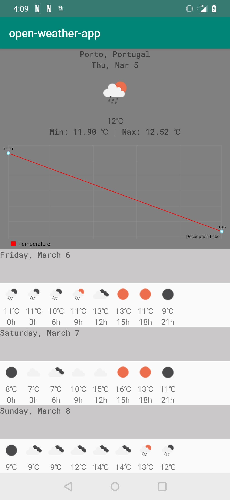

# Open Weather App

Attention: To run the app properly you need to get a valid API key, you can find detailed info here:

https://openweathermap.org/appid

In the openweather.properties file, replace your valid API key by the `<replace-by-valid-key>` text.

